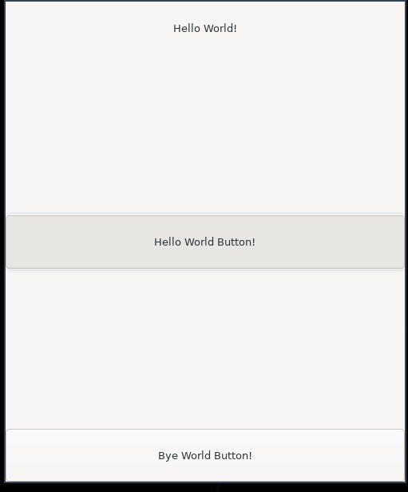

# Learning how to use GTK 4 in C

trying to learn how to develop in gtk4, this is based on the following lessons:

[toshiocp_tutorials](https://toshiocp.github.io/Gtk4-tutorial) 
[toshiocp_tutorials_gobject](https://toshiocp.github.io/Gobject-tutorial/)

## Set Up and Installation process

1. Install gtk 4.0 
    `sudo apt install libgtk-4-dev`
2. Install bear to automatically generated compilation flags and libs - This will help clangd lsp.
3. Install Make
4. Run `bear -- make build` this will build the project and create a file called `./compile_commands.json`

### Section 1_5

Result: 

